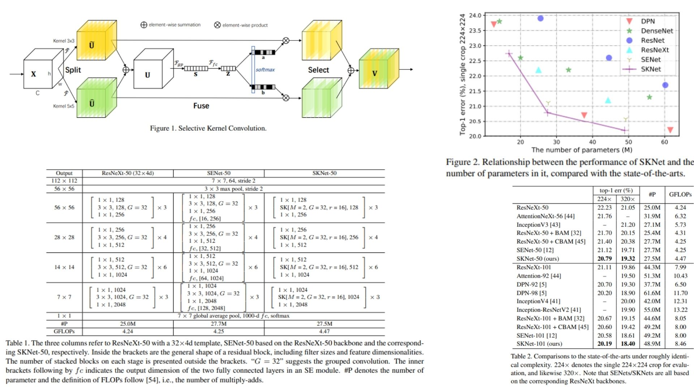

# ⟁ SelectiveKernel-Replication — Adaptive Receptive Fields in CNNs

This repository provides a **faithful PyTorch replication** of  
**Selective Kernel Networks (SKNet)**, a dynamic convolutional mechanism  
that enables neurons to **adaptively adjust their receptive field sizes**  
based on input content .

The goal of this project is **conceptual clarity and structural fidelity** —  
translating the paper’s **biological motivation, mathematical formulation,  
and block-level design** into clean, modular code, **without training, datasets,  
or benchmark comparisons**.

Core properties:
- **Multi-branch convolutional paths** with different kernel sizes ⧖
- **Input-conditioned soft attention** over spatial scales ⟐
- **Nonlinear feature aggregation** instead of linear fusion ⧗
- Minimal overhead with fully convolutional design ⟁⃞

**Paper reference:**  [Selective Kernel Networks (Li et al., CVPR 2019)](https://arxiv.org/abs/1903.06586) ⧉


---

## ⧖ Overview — Receptive Fields as a Dynamic Quantity



> In biological vision systems, receptive field sizes are not fixed —  
> they expand or contract depending on the stimulus.  
> **Selective Kernel Networks bring this principle into CNNs.**

Standard CNN layers enforce a **single kernel size per layer**,  
forcing all neurons to observe the same spatial scale.  
SKNet replaces this rigidity with **adaptive selection across scales**.

At each SK block:
- Multiple convolutional branches extract features at different scales
- Their responses are fused to build a global descriptor
- A soft attention mechanism **selects how much each scale contributes**

As a result, neurons can emphasize **local details or global context**  
depending on the input — *during inference*.

---

## 🧮 Selective Kernel Formulation

Given an input feature map

$$
X \in \mathbb{R}^{C \times H \times W},
$$

Selective Kernel Convolution is defined by three stages:  
**Split**, **Fuse**, and **Select**.

---

### Split — Multi-Scale Feature Extraction

The input is processed by multiple convolutional branches  
with different kernel sizes:

$$
U_m = \mathcal{F}_m(X), \quad m = 1, \dots, M
$$

For the standard two-branch case:

- Branch 1: $$3 \times 3$$ convolution  
- Branch 2: $$5 \times 5$$ convolution (approximated via dilated $$3 \times 3$$)

Each branch produces:

$$
U_m \in \mathbb{R}^{C \times H \times W}
$$

---

### Fuse — Global Context Embedding

Branch outputs are first aggregated by element-wise summation:

$$
U = \sum_{m=1}^{M} U_m
$$

Global spatial information is then embedded via **Global Average Pooling**:

$$
s_c = \frac{1}{H W} \sum_{i=1}^{H} \sum_{j=1}^{W} U_c(i, j)
$$

yielding a channel descriptor:

$$
s \in \mathbb{R}^{C}
$$

This descriptor is compressed through a fully connected transformation:

$$
z = \delta \bigl( \text{BN}(W s) \bigr),
$$

where:
- $$W \in \mathbb{R}^{d \times C}$$
- $$\delta(\cdot)$$ is ReLU

---

### Select — Soft Attention Across Scales

For each branch, channel-wise attention weights are computed via softmax:

$$
a_{m,c} =
\frac{e^{A_m^c z}}{\sum_{n=1}^{M} e^{A_n^c z}}
$$

The final output feature map is obtained as a weighted sum:

$$
V_c = \sum_{m=1}^{M} a_{m,c} \cdot U_{m,c}
$$

This mechanism ensures:
- Attention weights sum to 1 per channel
- Different channels can favor different kernel sizes
- Effective receptive field size becomes **input-dependent**

---

## ⚙ Architectural Principle

- **Nonlinear selection beats linear aggregation**
- **Softmax attention enables competition between scales**
- **Global context guides local kernel choice**
- Fully differentiable and inference-adaptive
- No explicit spatial attention, no channel squeezing collapse

SK blocks can be stacked to form **SKNet-26 / 50 / 101**  
or embedded into custom backbones with minimal modification.

---

## 🧩 Repository Structure

```bash
SelectiveKernel-Replication/
├── src/
│   ├── utils/
│   │   └── visualization.py
│   │
│   ├── attention/
│   │   ├── gap_pool.py
│   │   ├── sk_branch.py
│   │   └── sk_attention.py
│   │
│   ├── layers/
│   │   └── conv_layers.py
│   │
│   ├── blocks/
│   │   └── sk_blocks.py
│   │
│   ├── models/
│   │   └── sknet_model.py
│   │
│   ├── pipeline.py
│   └── config.py
│
├── images/
│   └── sk_attention_maps.jpg
│
├── requirements.txt
└── README.md
```
---


## 🔗 Feedback

For questions or feedback, contact: [barkin.adiguzel@gmail.com](mailto:barkin.adiguzel@gmail.com)
